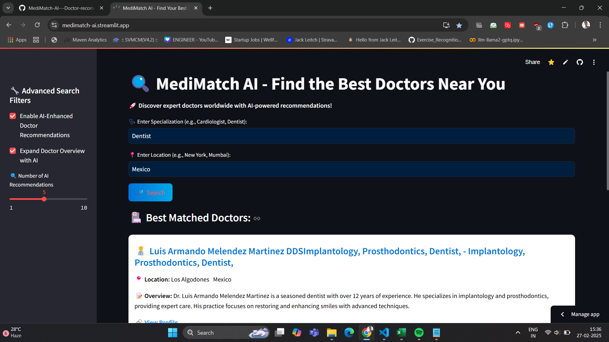
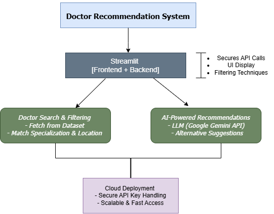

# 🩺 MediMatch AI - Doctor Recommendation System

🚀 Its an - AI-Powered Web App to Find the Best Doctors Globally.

# 🌍 Deployed Live App
-- https://medimatch-ai.streamlit.app/

This app is fully deployed in production and accessible globally.

 ###### MediMatch AI is a production-ready web application that uses Streamlit and LLMs (Gemini AI) to help users find top-rated doctors worldwide.
🔍 Real-time recommendations based on specialization, location, and AI-enhanced doctor insights.
🌍 Find doctors from different countries and get AI-powered recommendations in a beautifully designed, interactive web app.

### Screenshots

Introduction:

In today's rapidly evolving healthcare landscape, finding the right doctor for a medical condition is a significant challenge. Patients often struggle with limited access to trusted specialists, geographical barriers, and lack of AI-powered insights for making informed decisions. Existing platforms either provide outdated directories or lack intelligent recommendations, making it difficult for users to connect with the best healthcare professionals worldwide.

-- Problem Statement
With the rise of telemedicine and global healthcare access, a solution is needed to help users discover top-rated doctors globally, analyze their expertise, and receive personalized AI-driven recommendations based on user preferences. MediMatch AI addresses this challenge by integrating Streamlit and Large Language Models (LLMs) to create an intelligent, real-time doctor search and recommendation system.

2. Approach & System Architecture

To solve this problem, I developed a production-ready, AI-powered web application using Streamlit and LLMs (Google Gemini AI). The application allows users to search for doctors based on specialization and location while providing intelligent alternative recommendations.

System Architecture:

User Input: Users enter specialization and location.
Doctor Search & Filtering: The system retrieves relevant doctors from the structured dataset.
AI-Powered Recommendation: Gemini API enhances results by suggesting additional specialists.
Frontend + Backend in Streamlit: A seamless, optimized UI for real-time interactions.
Cloud Deployment: Hosted on Streamlit Cloud for global accessibility.

Deployment & Production Readiness

The MediMatch AI web application is fully deployed in a production environment, making it accessible worldwide. This ensures high availability, security, and real-time AI-driven insights for users. The deployment was optimized with best practices to ensure scalability and seamless performance. Key highlights of the deployment include:

🔹 End-to-End Streamlit Deployment: The app is built, hosted, and optimized within Streamlit Cloud, ensuring zero maintenance overhead.

🔹 Real-Time AI Processing: The system leverages on-demand API calls to LLMs, providing instant, intelligent recommendations with minimal latency.

🔹 Optimized Security & API Management: The application securely handles Google API keys via Streamlit Cloud secrets, ensuring confidentiality and secure access management.

🔹 Seamless CI/CD Integration: Any updates pushed to GitHub automatically reflect in the live application, allowing continuous improvements without downtime.

🔹 Scalability & Global Access: The platform is designed to handle multiple users concurrently, making it an ideal solution for real-world adoption.

With a strong focus on AI integration, security, and performance, MediMatch AI is not just a concept—it is a fully functional AI-powered solution deployed for global accessibility.

#### Drawbacks & Edge Cases: 

While MediMatch AI provides a strong AI-powered recommendation system, there are some limitations and edge cases that need to be considered:

🔸 Lack of Real-Time Doctor Availability: The system provides AI-driven recommendations, but it does not check live availability of doctors.
🔸 Dependence on Dataset Accuracy: If the input dataset is outdated or contains incorrect information, the recommendations may not be fully reliable.
🔸 Bias in AI Model Recommendations: The LLM (Gemini AI) might generate biased suggestions if trained on imbalanced data, requiring continuous monitoring and fine-tuning.

